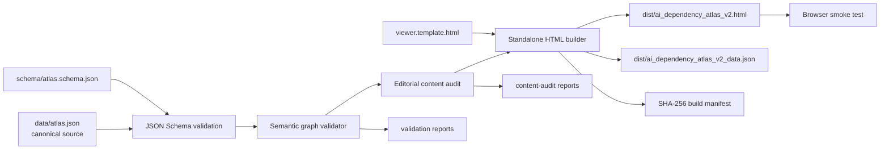
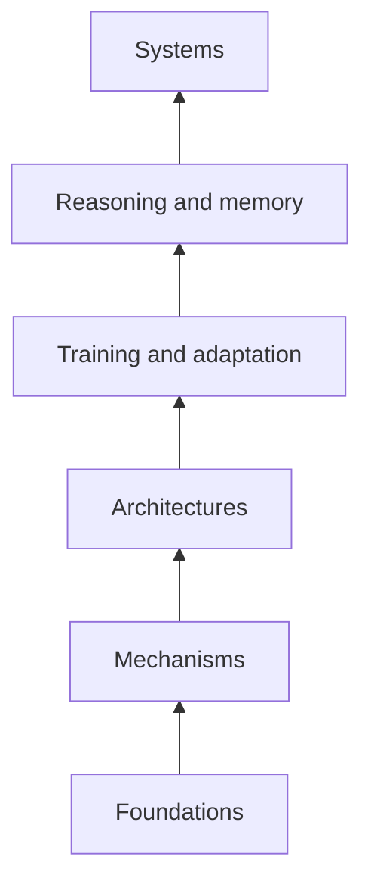
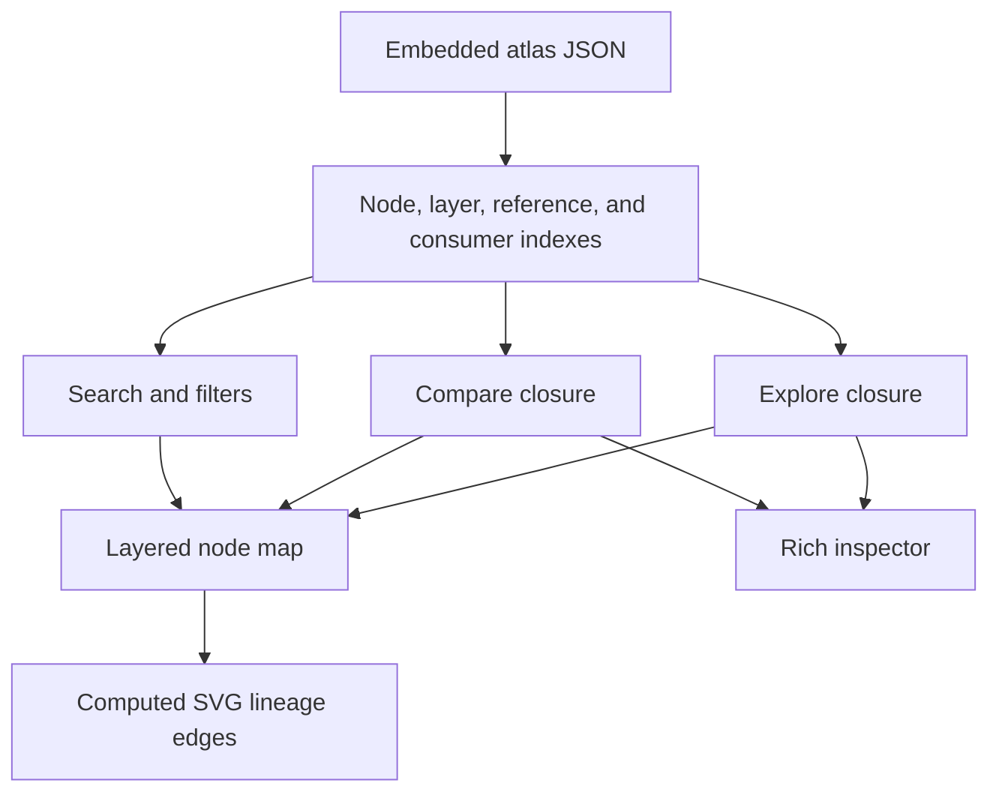

# Project Architecture

## Build architecture

The canonical source is `data/atlas.json`. The viewer template never acts as a second source of graph truth: `tools/build_atlas.py` validates the canonical JSON, embeds its minified form into one placeholder, and exports an exact JSON copy beside the HTML.

## Graph direction

A node stores its prerequisites in `dependencies`. Therefore, the serialized edge direction is:

The UI builds a reverse consumer index at runtime so it can trace both directions:

Same-layer edges are allowed for relationships such as specialization and composition. Layer order prevents a concept from depending on a concept in a higher layer, and the validator independently enforces acyclicity.

## Runtime architecture

The generated viewer has no third-party runtime dependency. It contains:

- inline CSS;
- a JSON script element containing the canonical graph;
- vanilla JavaScript for indexing, search, filtering, lineage closure, comparison, inspector rendering, and SVG edges;
- reference links that are inert until selected by the user.

## Validation architecture

`tools/validate_atlas.py` checks:

- Draft 2020-12 JSON Schema conformance;
- unique layer, node, order, and reference identifiers;
- valid layer membership;
- dependency existence, uniqueness, type, strength, and direction;
- reference existence;
- directed-acyclic-graph topology and maximum depth;
- unique concept definitions and forbidden legacy boilerplate;
- required content fields and minimum lengths;
- terminal declarations against actual consumer topology;
- required modern-coverage nodes;
- declared statistics against recomputed statistics.

`tools/audit_content.py` is intentionally different: it reports editorial provenance, graph-derived pattern usage, field-length distributions, reference concentration, and topology. An audit finding is not automatically a build failure because the purpose is to reveal editorial debt rather than hide it.

The current audit is not a sentence-level source audit. The stricter process for that claim is defined in [`SOURCE_AUDIT.md`](SOURCE_AUDIT.md), and the bounded completeness roadmap is defined in [`EXHAUSTIVENESS_ROADMAP.md`](EXHAUSTIVENESS_ROADMAP.md).

## Determinism

The build contains no current-time stamp. Version and update date come from canonical metadata. `build_manifest.json` hashes:

- canonical data;
- schema;
- viewer template;
- validator;
- content auditor;
- generated HTML;
- exported JSON;
- validation reports;
- content-audit reports.

Given identical inputs and the same JSON serialization behavior, the generated artifacts are byte-reproducible.
